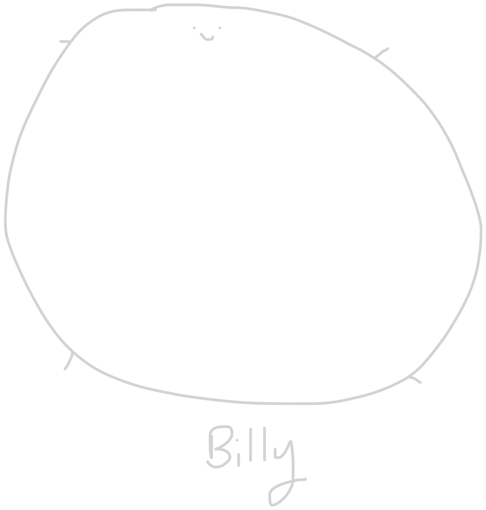

my name is Sanjay. i'm a third year from uoft doing both cs and math. i enjoy building **system projects** and occasionally **full-stack applications**.

my current project is a k-v store from scratch that dives into how a modern write-based database works and how it mitigates expensive write operations to the disk while maintaining durability against crashes. check out the repo here! [quomDB](https://github.com/sanjay5217/quom)

  
 

  

